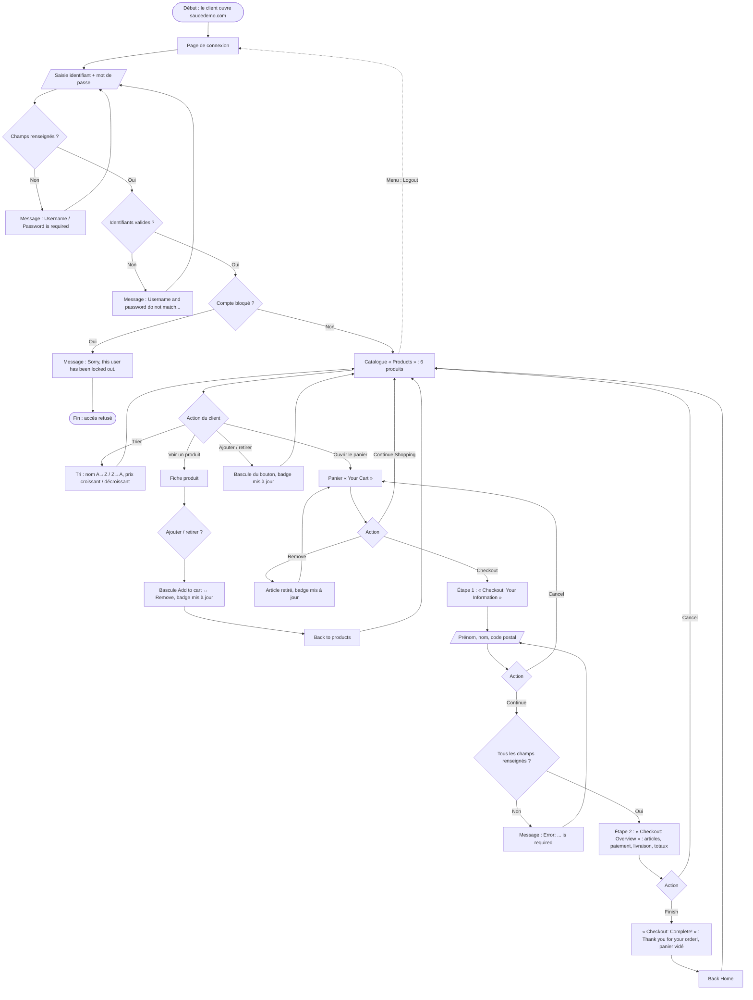

# Analyse des processus — Parcours d'achat actuel (« As-Is »)

Ce document décrit le parcours d'achat **tel qu'il fonctionne aujourd'hui** sur Swag Labs, observé avec le compte de référence `standard_user`.

## 1. Acteurs

| Acteur | Description |
|---|---|
| Client | Utilisateur disposant d'un compte actif, qui souhaite acheter des articles |
| Client bloqué | Utilisateur dont le compte est verrouillé (`locked_out_user`) |
| Application Swag Labs | Système qui authentifie, affiche le catalogue, gère le panier et enregistre la commande |

## 2. Diagramme du processus

## 3. Tableau des étapes du parcours nominal

| # | Étape | Page (URL) | Action du client | Données | Réponse du système | Règles |
|---|---|---|---|---|---|---|
| 1 | Connexion | `/` | Saisit identifiant et mot de passe, clique sur **Login** | `standard_user` / `secret_sauce` | Redirige vers le catalogue | RG-01 à RG-05 |
| 2 | Consultation du catalogue | `/inventory.html` | Parcourt la liste « Products » | — | Affiche 6 produits (image, nom, description, prix, bouton **Add to cart**), triés par nom A→Z | RG-07, RG-08 |
| 3 | Tri (optionnel) | `/inventory.html` | Choisit une option de tri | Name (A to Z), Name (Z to A), Price (low to high), Price (high to low) | Réordonne la liste | RG-08 |
| 4 | Détail produit (optionnel) | `/inventory-item.html?id=<n>` | Clique sur le nom ou l'image d'un produit | — | Affiche la fiche (nom, description, prix, image, bouton d'ajout, **Back to products**) | RG-07, RG-09 |
| 5 | Ajout au panier | catalogue ou fiche | Clique sur **Add to cart** | — | Le bouton devient **Remove**, le badge du panier s'incrémente | RG-09, RG-10, RG-11 |
| 6 | Consultation du panier | `/cart.html` | Clique sur l'icône panier | — | Liste « Your Cart » : quantité (QTY), nom, description, prix, boutons **Remove**, **Continue Shopping**, **Checkout** | RG-10, RG-11, RG-12 |
| 7 | Informations client | `/checkout-step-one.html` | Clique sur **Checkout**, renseigne le formulaire, clique sur **Continue** | Prénom, nom, code postal | Passe au récapitulatif si tout est renseigné, sinon affiche un message d'erreur | RG-13 |
| 8 | Récapitulatif | `/checkout-step-two.html` | Vérifie la commande | — | Affiche articles, « SauceCard #31337 », « Free Pony Express Delivery! », Item total, Tax, Total | RG-14, RG-15 |
| 9 | Validation | `/checkout-complete.html` | Clique sur **Finish** | — | Affiche « Thank you for your order! » et vide le panier | RG-16 |
| 10 | Retour | `/inventory.html` | Clique sur **Back Home** | — | Retour au catalogue, badge absent | RG-11, RG-16 |

## 4. Flux alternatifs et d'exception

| Réf. | Déclencheur | Étape | Comportement observé | Règles |
|---|---|---|---|---|
| FA-01 | Identifiant ou mot de passe vide | 1 | Message d'erreur, reste sur la page de connexion | RG-01 |
| FA-02 | Identifiants incorrects (y compris casse différente) | 1 | « Epic sadface: Username and password do not match any user in this service » | RG-02 |
| FA-03 | Compte bloqué | 1 | « Epic sadface: Sorry, this user has been locked out. » | RG-03 |
| FA-04 | Accès direct à une page protégée sans être connecté | toutes | Retour à la page de connexion avec « You can only access '/…' when you are logged in. » | RG-04 |
| FA-05 | Retrait d'un article | 4, 5, 6 | Le bouton redevient **Add to cart** (catalogue / fiche) ou la ligne disparaît (panier). Badge décrémenté, masqué à 0 | RG-09, RG-11 |
| FA-06 | **Continue Shopping** | 6 | Retour au catalogue, panier conservé | RG-12 |
| FA-07 | Champ obligatoire manquant | 7 | « Error: First Name / Last Name / Postal Code is required » | RG-13 |
| FA-08 | **Cancel** à l'étape 1 | 7 | Retour au **panier**, contenu conservé | RG-17 |
| FA-09 | **Cancel** à l'étape 2 | 8 | Retour au **catalogue**, panier conservé | RG-17 |
| FA-10 | Menu → **Logout** | toutes | Fin de session, retour à la page de connexion. Le panier est retrouvé à la reconnexion | RG-06, RG-12 |
| FA-11 | Menu → **Reset App State** | toutes | Panier vidé, badge masqué | RG-18 |

## 5. Points d'attention relevés pendant l'analyse

Les comportements suivants ont été **observés et reproduits** avec `standard_user` pendant l'analyse. Ils seront qualifiés (anomalie ou non) pendant la phase de test :

| # | Observation | Impact métier potentiel |
|---|---|---|
| PA-1 | Un prénom, un nom et un code postal composés uniquement d'**espaces** sont acceptés : on passe à l'étape 2 | Commande sans informations client exploitables |
| PA-2 | On peut lancer **Checkout** avec un panier **vide** et aller jusqu'à la confirmation (totaux à $0 / $0.00) | Commande vide enregistrée |
| PA-3 | Après **Reset App State** sur le catalogue, le badge disparaît mais les boutons restent sur **Remove** jusqu'au rechargement de la page | Affichage incohérent avec le contenu réel du panier |
| PA-4 | Le tri choisi n'est pas conservé après un rechargement de la page (retour à Name (A to Z)) | Confort d'utilisation |

## 6. Pistes d'amélioration (« To-Be », hors périmètre de recette)

- Supprimer les espaces en début et en fin de saisie avant de valider les champs du formulaire (PA-1).
- Désactiver **Checkout** quand le panier est vide (PA-2).
- Permettre de modifier la quantité d'un article dans le panier : aujourd'hui, la quantité est toujours de 1.
- Conserver le critère de tri pendant la session (PA-4).
