# Rapports d'anomalies

Toutes les anomalies ci-dessous ont été **reproduites par script Playwright** dans un navigateur neuf avant d'être documentées. Les captures d'écran se trouvent dans [`captures/`](captures/).

**Environnement commun** : <https://www.saucedemo.com> (production, septembre 2026) · Chromium 153.0.8010.12 via Playwright 1.63.0 · 1280 × 800 · macOS · mot de passe `secret_sauce` · date de constat : 30/09/2026.

Échelles de sévérité et de priorité : voir la [stratégie de test](01_strategie_de_test.md#8-classification-des-anomalies).

## Synthèse

| ID | Titre | Utilisateur(s) | Sévérité | Priorité | US | CT / source |
|---|---|---|---|---|---|---|
| [BUG-01](#bug-01) | Une commande peut être validée avec un panier vide | standard_user | Majeure | P2 | US-16 | CT-43 |
| [BUG-02](#bug-02) | Le formulaire de commande accepte des champs composés d'espaces | standard_user | Mineure | P3 | US-14 | CT-35 |
| [BUG-03](#bug-03) | Après « Reset App State », les boutons restent sur « Remove » | standard_user | Mineure | P3 | US-13 | CT-29 |
| [BUG-04](#bug-04) | Tous les produits affichent la même image (chien) | problem_user | Majeure | P2 | US-06 | Exploratoire |
| [BUG-05](#bug-05) | Le tri du catalogue est sans effet | problem_user | Majeure | P2 | US-08 | Exploratoire |
| [BUG-06](#bug-06) | Un clic sur un produit ouvre la fiche d'un autre produit | problem_user | Majeure | P1 | US-07 | Exploratoire |
| [BUG-07](#bug-07) | Impossible d'ajouter 3 produits au panier depuis le catalogue | problem_user, error_user | Majeure | P1 | US-09 | Exploratoire |
| [BUG-08](#bug-08) | Le bouton « Remove » du catalogue est sans effet | problem_user, error_user | Majeure | P2 | US-10 | Exploratoire |
| [BUG-09](#bug-09) | La saisie du nom écrase le prénom : commande impossible | problem_user | Bloquante | P1 | US-14 | Exploratoire |
| [BUG-10](#bug-10) | Le tri déclenche une alerte « Sorting is broken! » | error_user | Majeure | P2 | US-08 | Exploratoire |
| [BUG-11](#bug-11) | Le champ « Last Name » n'accepte aucune saisie mais le formulaire est validé | error_user | Majeure | P1 | US-14 | Exploratoire |
| [BUG-12](#bug-12) | Le bouton « Finish » est sans effet : commande impossible | error_user | Bloquante | P1 | US-16 | Exploratoire |
| [BUG-13](#bug-13) | Prix du catalogue faux et différents à chaque chargement | visual_user | Majeure | P1 | US-06 | Exploratoire |
| [BUG-14](#bug-14) | Image du Backpack incorrecte (chien) | visual_user | Mineure | P3 | US-06 | Exploratoire |
| [BUG-15](#bug-15) | Éléments d'interface décalés (panier, Checkout, titres, bouton) | visual_user | Mineure | P3 | US-06, US-12 | Exploratoire |
| [BUG-16](#bug-16) | Connexion et tri prennent environ 5 secondes | performance_glitch_user | Mineure | P3 | US-01, US-08 | Observation |

| Sévérité | Nombre |
|---|---|
| Bloquante | 2 |
| Majeure | 9 |
| Mineure | 5 |
| Cosmétique | 0 |
| **Total** | **16** |

---

## BUG-01 — Une commande peut être validée avec un panier vide

| Champ | Valeur |
|---|---|
| Sévérité / Priorité | Majeure / P2 |
| Utilisateur | `standard_user` |
| US / CT | US-16 · CT-43 |
| Statut | Ouvert |

**Étapes de reproduction**
1. Se connecter avec `standard_user` (panier vide).
2. Cliquer sur l'icône du panier : la page « Your Cart » ne contient aucun article.
3. Cliquer sur « Checkout ».
4. Saisir Marie / Curie / 75005, puis cliquer sur « Continue ».
5. Cliquer sur « Finish ».

**Résultat attendu** : il est impossible de lancer une commande avec un panier vide (bouton « Checkout » inactif ou message d'information).

**Résultat obtenu** : le formulaire s'ouvre, le récapitulatif affiche « Item total: $0 », « Tax: $0.00 », « Total: $0.00 », et « Finish » affiche « Thank you for your order! ». Une commande vide est confirmée. On note aussi un format incohérent : `$0` pour le sous-total, `$0.00` pour la taxe et le total.

**Capture** : 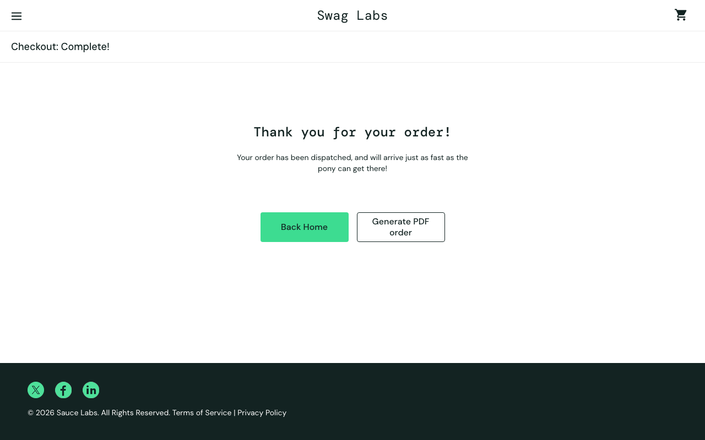

---

## BUG-02 — Le formulaire de commande accepte des champs composés d'espaces

| Champ | Valeur |
|---|---|
| Sévérité / Priorité | Mineure / P3 |
| Utilisateur | `standard_user` |
| US / CT | US-14 · CT-35 · RG-13 |
| Statut | Ouvert |

**Étapes de reproduction**
1. Se connecter avec `standard_user` et ajouter « Sauce Labs Backpack » au panier.
2. Ouvrir le panier, puis cliquer sur « Checkout ».
3. Saisir trois espaces dans « First Name », « Last Name » et « Zip/Postal Code ».
4. Cliquer sur « Continue ».

**Résultat attendu** : les champs sont considérés comme vides, et le message « Error: First Name is required » s'affiche.

**Résultat obtenu** : aucun message ; l'étape « Checkout: Overview » s'affiche. La commande peut être passée sans nom ni code postal exploitables.

**Capture** : 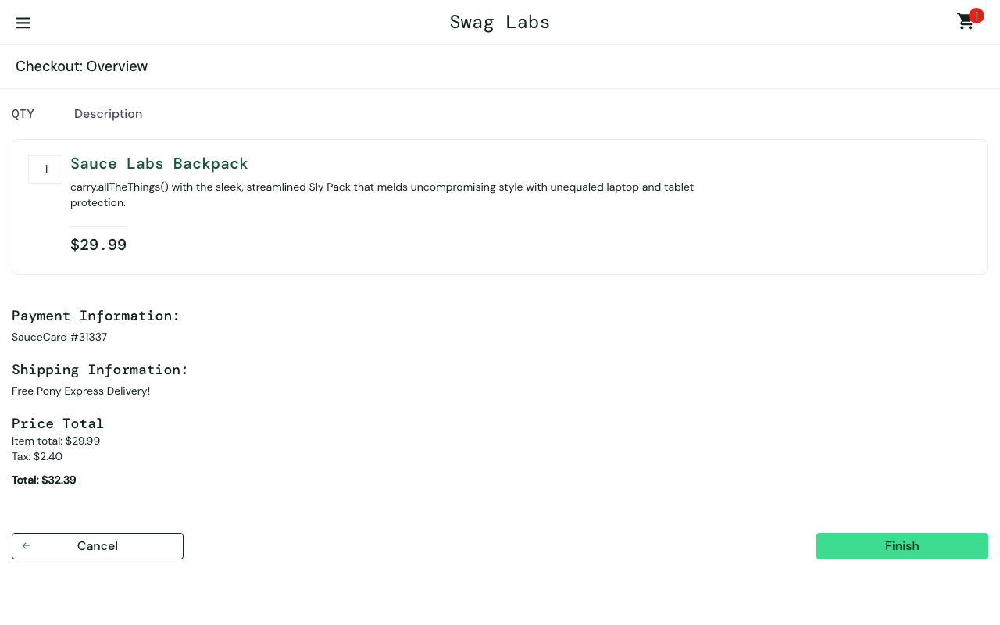

---

## BUG-03 — Après « Reset App State », les boutons restent sur « Remove »

| Champ | Valeur |
|---|---|
| Sévérité / Priorité | Mineure / P3 |
| Utilisateur | `standard_user` |
| US / CT | US-13 · CT-29 · RG-18 |
| Statut | Ouvert |

**Étapes de reproduction**
1. Se connecter avec `standard_user`.
2. Ajouter « Sauce Labs Backpack » et « Sauce Labs Bike Light » au panier (badge « 2 »).
3. Ouvrir le menu ☰ et cliquer sur « Reset App State », puis fermer le menu.
4. Observer les boutons des deux produits, puis cliquer sur « Remove » du Backpack.

**Résultat attendu** : le badge disparaît et tous les boutons reviennent à « Add to cart ».

**Résultat obtenu** : le badge disparaît (le panier est bien vidé), mais les 2 boutons affichent toujours « Remove ». Un clic sur « Remove » n'a aucun effet visible. L'affichage ne se remet en cohérence qu'après un rechargement de la page.

**Capture** : 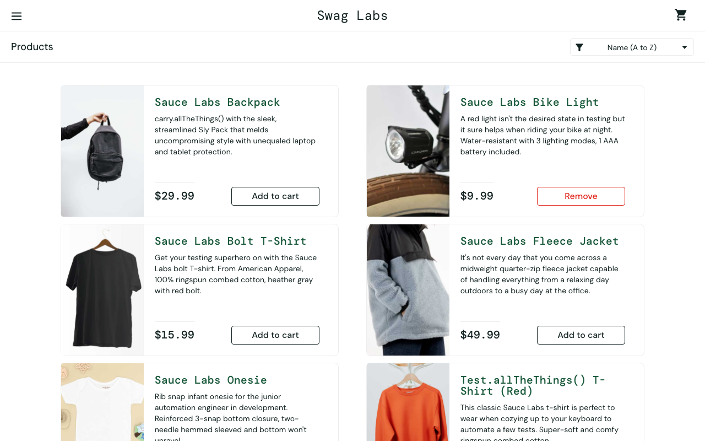

---

## BUG-04 — Tous les produits affichent la même image (chien)

| Champ | Valeur |
|---|---|
| Sévérité / Priorité | Majeure / P2 |
| Utilisateur | `problem_user` |
| US / CT | US-06 · RG-07 · session exploratoire 1 |
| Statut | Ouvert |

**Étapes de reproduction**
1. Se connecter avec `problem_user`.
2. Observer les images du catalogue.

**Résultat attendu** : chaque produit affiche sa propre photo, comme avec `standard_user`.

**Résultat obtenu** : les 6 produits affichent la même image (un chien, fichier `sl-404-Cq1a9k9X.jpg`). Le client ne peut pas identifier visuellement les articles.

**Capture** : 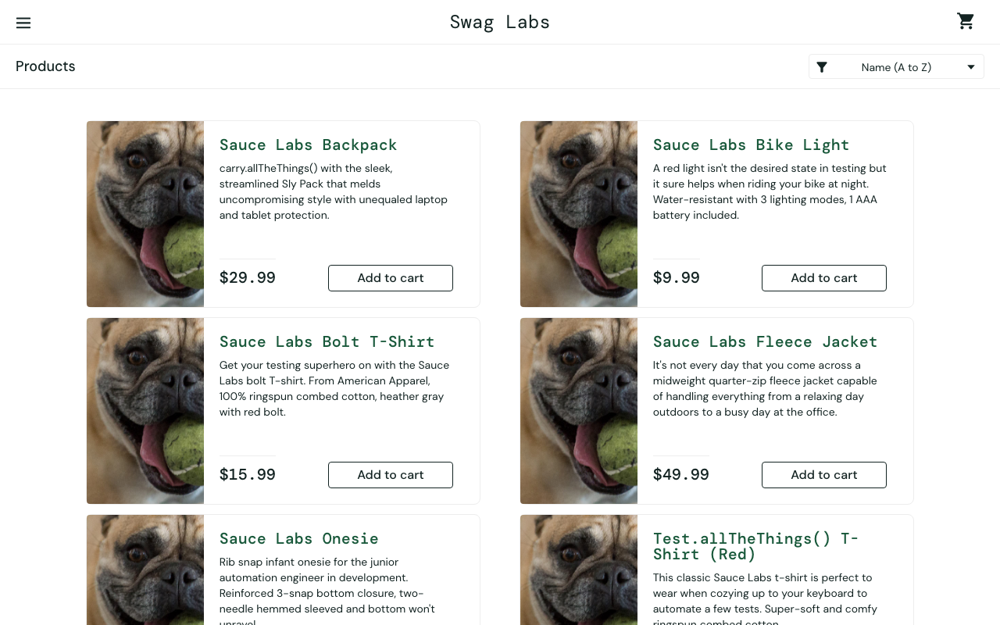

---

## BUG-05 — Le tri du catalogue est sans effet

| Champ | Valeur |
|---|---|
| Sévérité / Priorité | Majeure / P2 |
| Utilisateur | `problem_user` |
| US / CT | US-08 · RG-08 · session exploratoire 1 |
| Statut | Ouvert |

**Étapes de reproduction**
1. Se connecter avec `problem_user`.
2. Choisir « Price (high to low) » dans le sélecteur de tri.

**Résultat attendu** : les produits sont triés par prix décroissant ; premier produit « Sauce Labs Fleece Jacket ».

**Résultat obtenu** : l'ordre ne change pas (premier produit « Sauce Labs Backpack ») et le sélecteur revient à « Name (A to Z) ». Même comportement pour les 4 options.

**Capture** : 

---

## BUG-06 — Un clic sur un produit ouvre la fiche d'un autre produit

| Champ | Valeur |
|---|---|
| Sévérité / Priorité | Majeure / P1 |
| Utilisateur | `problem_user` |
| US / CT | US-07 · RG-07 · session exploratoire 1 |
| Statut | Ouvert |

**Étapes de reproduction**
1. Se connecter avec `problem_user`.
2. Cliquer sur le nom « Sauce Labs Backpack ».
3. Revenir au catalogue et cliquer sur le nom « Sauce Labs Fleece Jacket ».

**Résultat attendu** : la fiche du produit cliqué s'affiche (Backpack : `inventory-item.html?id=4`).

**Résultat obtenu** :
- Backpack → `inventory-item.html?id=5`, fiche « Sauce Labs Fleece Jacket » ;
- Fleece Jacket → `inventory-item.html?id=6`, fiche « ITEM NOT FOUND ».

Tous les liens pointent vers l'identifiant suivant. Le client risque d'acheter un autre article que celui qu'il a choisi.

**Capture** : 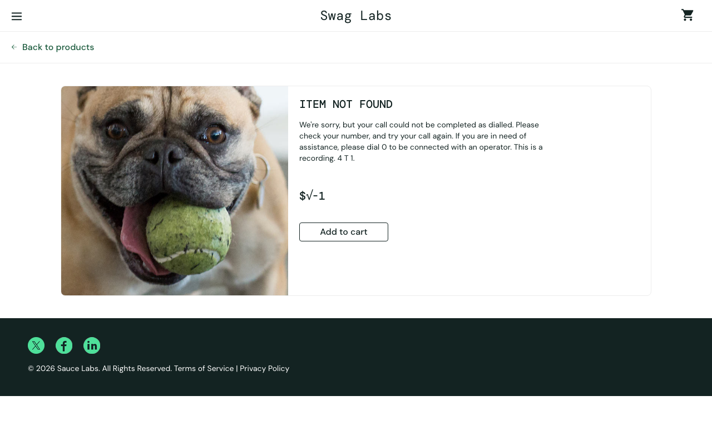

---

## BUG-07 — Impossible d'ajouter 3 produits au panier depuis le catalogue

| Champ | Valeur |
|---|---|
| Sévérité / Priorité | Majeure / P1 |
| Utilisateurs | `problem_user`, `error_user` |
| US / CT | US-09 · RG-09 · sessions exploratoires 1 et 2 |
| Statut | Ouvert |

**Étapes de reproduction**
1. Se connecter avec `problem_user` (ou `error_user`).
2. Cliquer sur « Add to cart » pour « Sauce Labs Bolt T-Shirt », « Sauce Labs Fleece Jacket », puis « Test.allTheThings() T-Shirt (Red) ».

**Résultat attendu** : chaque bouton passe à « Remove » et le badge augmente de 1 (jusqu'à « 3 »).

**Résultat obtenu** : aucun effet ; le bouton reste « Add to cart » et le badge n'apparaît pas. Les 3 autres produits (Backpack, Bike Light, Onesie) s'ajoutent normalement.

**Captures** : 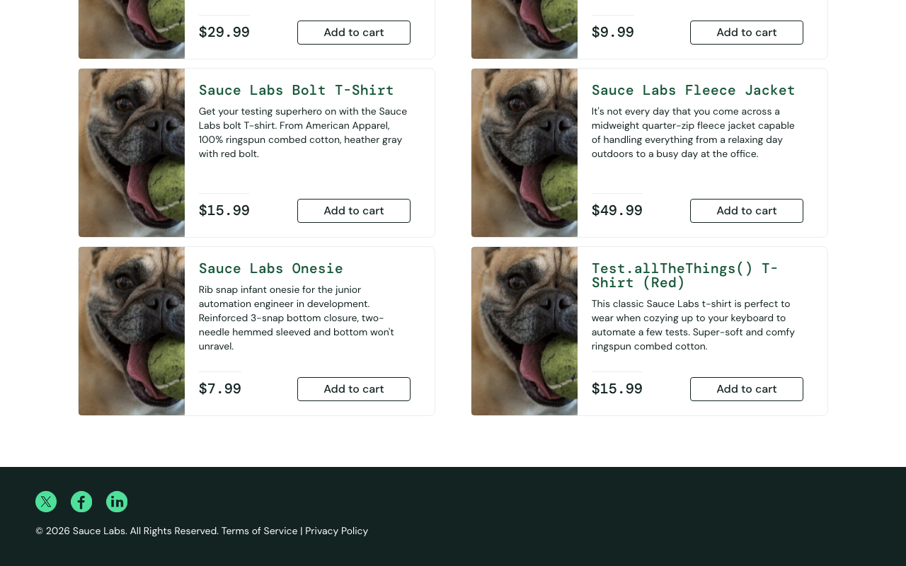 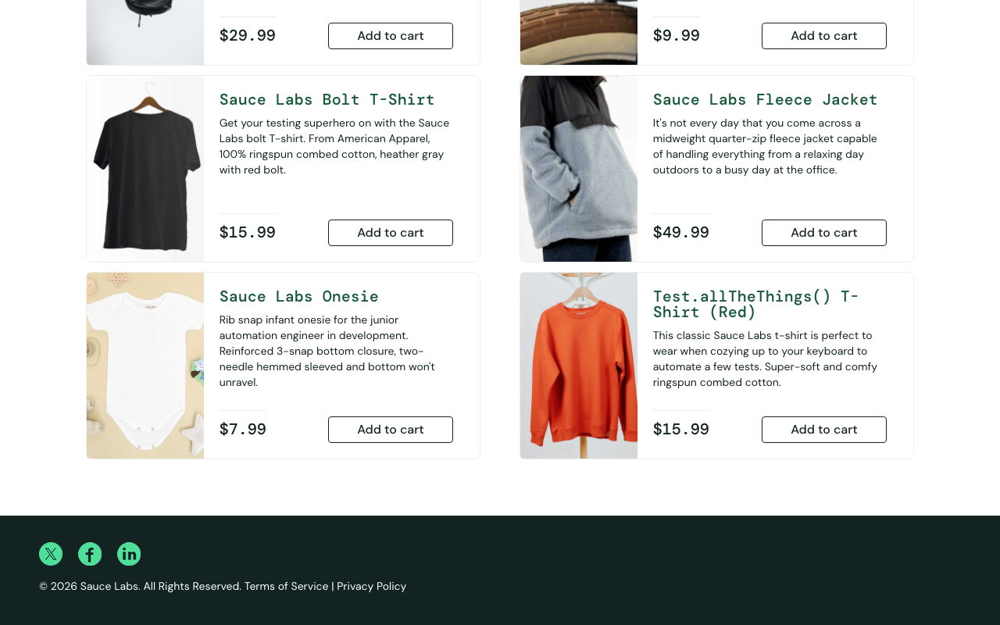

---

## BUG-08 — Le bouton « Remove » du catalogue est sans effet

| Champ | Valeur |
|---|---|
| Sévérité / Priorité | Majeure / P2 |
| Utilisateurs | `problem_user`, `error_user` |
| US / CT | US-10 · RG-09 · sessions exploratoires 1 et 2 |
| Statut | Ouvert |

**Étapes de reproduction**
1. Se connecter avec `problem_user` (ou `error_user`).
2. Cliquer sur « Add to cart » de « Sauce Labs Backpack » (badge « 1 »).
3. Cliquer sur « Remove » du même produit dans le catalogue.

**Résultat attendu** : le bouton revient à « Add to cart » et le badge disparaît.

**Résultat obtenu** : le bouton reste « Remove » et le badge reste à « 1 ». *Contournement* : pour `problem_user`, le retrait fonctionne depuis la page panier.

**Captures** : 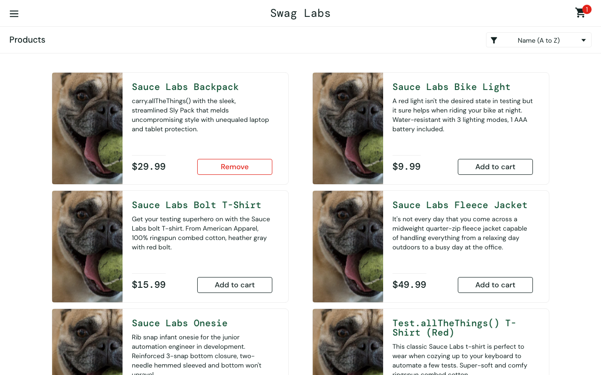 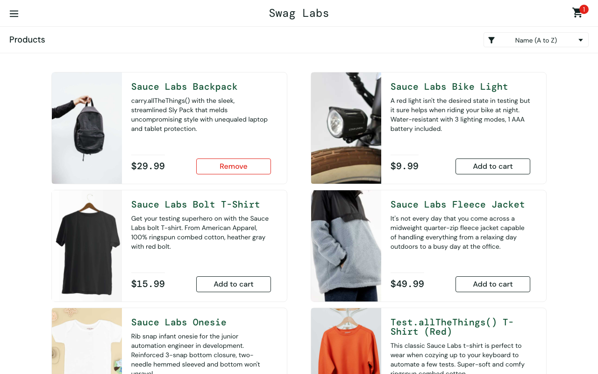

---

## BUG-09 — La saisie du nom écrase le prénom : commande impossible

| Champ | Valeur |
|---|---|
| Sévérité / Priorité | **Bloquante** / P1 |
| Utilisateur | `problem_user` |
| US / CT | US-14 · RG-13 · session exploratoire 1 |
| Statut | Ouvert |

**Étapes de reproduction**
1. Se connecter avec `problem_user`, avoir un article au panier, ouvrir « Checkout ».
2. Taper « Marie » dans « First Name », puis « Curie » dans « Last Name », puis « 75005 » dans « Zip/Postal Code ».
3. Cliquer sur « Continue ».

**Résultat attendu** : les champs contiennent Marie / Curie / 75005 et l'étape « Checkout: Overview » s'affiche.

**Résultat obtenu** : chaque caractère tapé dans « Last Name » **remplace le contenu de « First Name »**. On obtient First Name = « e » (dernière lettre de Curie) et Last Name vide. Le message « Error: Last Name is required » s'affiche, et il n'y a **aucun contournement** : la commande est impossible.

**Capture** : 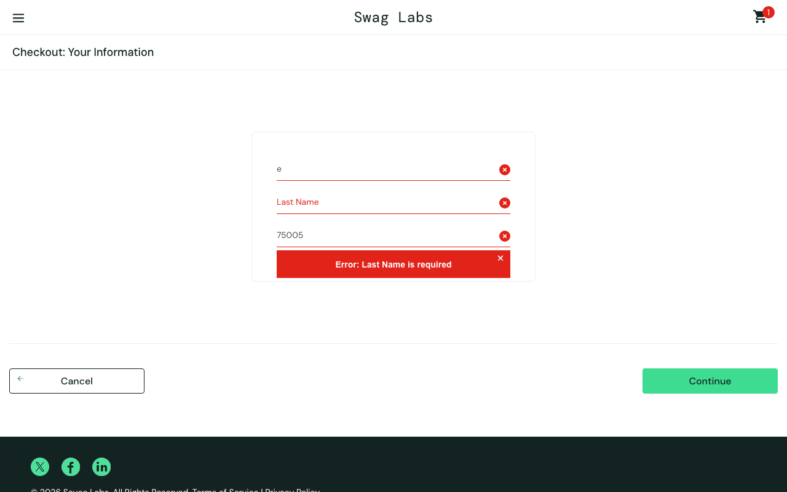

---

## BUG-10 — Le tri déclenche une alerte « Sorting is broken! »

| Champ | Valeur |
|---|---|
| Sévérité / Priorité | Majeure / P2 |
| Utilisateur | `error_user` |
| US / CT | US-08 · RG-08 · session exploratoire 2 |
| Statut | Ouvert |

**Étapes de reproduction**
1. Se connecter avec `error_user`.
2. Choisir « Price (high to low) » dans le sélecteur de tri.

**Résultat attendu** : les produits sont triés par prix décroissant.

**Résultat obtenu** : une alerte du navigateur s'affiche : « Sorting is broken! This error has been reported to Backtrace. ». Après fermeture, la liste n'est pas triée (premier produit « Sauce Labs Backpack ») et le sélecteur affiche « Name (A to Z) ».

**Capture** :  *(capture prise après la fermeture de l'alerte)*

---

## BUG-11 — Le champ « Last Name » n'accepte aucune saisie mais le formulaire est validé

| Champ | Valeur |
|---|---|
| Sévérité / Priorité | Majeure / P1 |
| Utilisateur | `error_user` |
| US / CT | US-14 · RG-13 · session exploratoire 2 |
| Statut | Ouvert |

**Étapes de reproduction**
1. Se connecter avec `error_user`, avoir un article au panier, ouvrir « Checkout ».
2. Taper « Marie », « Curie », « 75005 » dans les trois champs.
3. Cliquer sur « Continue ».

**Résultat attendu** : les trois champs sont remplis ; ou, si le nom est vide, le message « Error: Last Name is required » s'affiche (RG-13).

**Résultat obtenu** : le champ « Last Name » reste **vide** (aucun caractère n'est accepté), et « Continue » mène quand même à « Checkout: Overview » **sans message d'erreur**. Deux défauts se cumulent : la saisie est impossible et le contrôle obligatoire est contourné.

**Capture** : 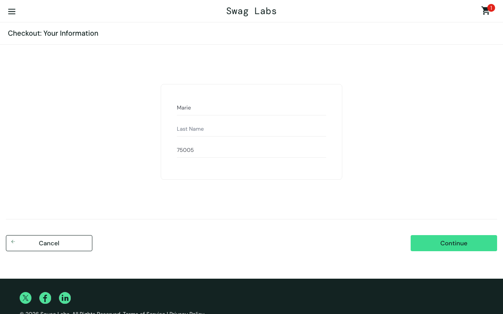

---

## BUG-12 — Le bouton « Finish » est sans effet : commande impossible

| Champ | Valeur |
|---|---|
| Sévérité / Priorité | **Bloquante** / P1 |
| Utilisateur | `error_user` |
| US / CT | US-16 · RG-16 · session exploratoire 2 |
| Statut | Ouvert |

**Étapes de reproduction**
1. Se connecter avec `error_user`, avoir « Sauce Labs Backpack » au panier.
2. Ouvrir « Checkout », saisir Marie / Curie / 75005, cliquer sur « Continue ».
3. Sur « Checkout: Overview », cliquer sur « Finish ».

**Résultat attendu** : la page « Checkout: Complete! » s'affiche avec « Thank you for your order! », et le panier est vidé.

**Résultat obtenu** : rien ne se passe ; on reste sur `checkout-step-two.html` et le badge affiche toujours « 1 ». Le client ne peut pas finaliser son achat.

**Capture** : 

---

## BUG-13 — Prix du catalogue faux et différents à chaque chargement

| Champ | Valeur |
|---|---|
| Sévérité / Priorité | Majeure / P1 |
| Utilisateur | `visual_user` |
| US / CT | US-06 · US-15 · RG-07 · session exploratoire 3 |
| Statut | Ouvert |

**Étapes de reproduction**
1. Se connecter avec `visual_user`.
2. Relever le prix du « Sauce Labs Backpack » dans le catalogue, puis recharger la page deux fois.
3. Ajouter le Backpack au panier et ouvrir le panier.

**Résultat attendu** : le Backpack est affiché à $29.99 partout (RG-07).

**Résultat obtenu** : le catalogue affiche un prix **différent à chaque chargement** ($68.46, puis $47.78, puis $47.55), alors que le panier et la fiche produit affichent $29.99. Les autres produits sont aussi touchés (ex. Bike Light à $0.11, Test.allTheThings() à « $14.2 », sans le deuxième chiffre des centimes). Le client voit un prix différent de celui qui lui sera facturé.

**Captures** : 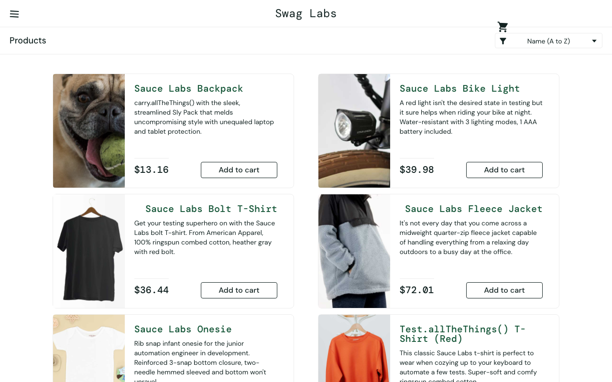 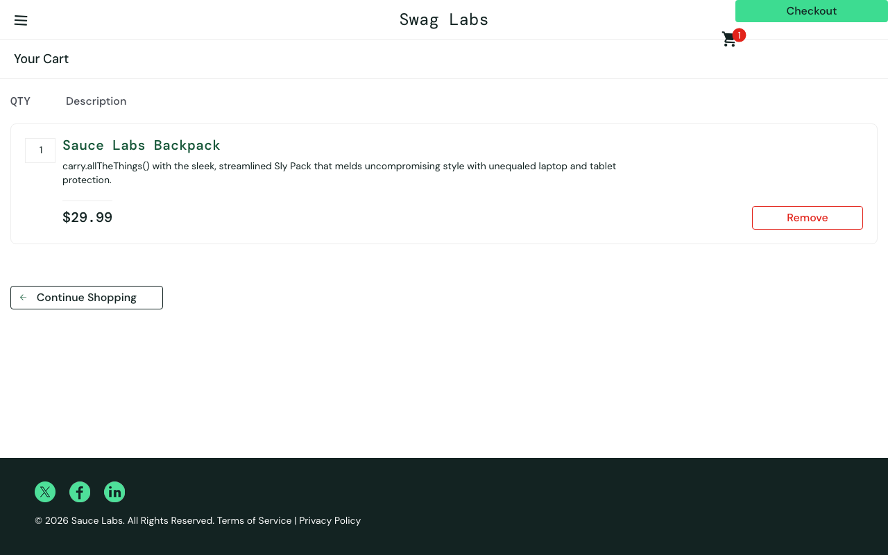

---

## BUG-14 — Image du Backpack incorrecte (chien)

| Champ | Valeur |
|---|---|
| Sévérité / Priorité | Mineure / P3 |
| Utilisateur | `visual_user` |
| US / CT | US-06 · RG-07 · session exploratoire 3 |
| Statut | Ouvert |

**Étapes de reproduction**
1. Se connecter avec `visual_user`.
2. Observer l'image du « Sauce Labs Backpack » dans le catalogue.

**Résultat attendu** : photo du sac à dos (`sauce-backpack-1200x1500…jpg`).

**Résultat obtenu** : image d'un chien (`sl-404-Cq1a9k9X.jpg`). Les 5 autres produits et la fiche produit du Backpack affichent la bonne image.

**Capture** : 

---

## BUG-15 — Éléments d'interface décalés

| Champ | Valeur |
|---|---|
| Sévérité / Priorité | Mineure / P3 |
| Utilisateur | `visual_user` |
| US / CT | US-06 · US-12 · session exploratoire 3 |
| Statut | Ouvert |

**Étapes de reproduction**
1. Se connecter avec `visual_user` et comparer le catalogue avec celui de `standard_user`.
2. Ajouter un article et ouvrir le panier.

**Résultat attendu** : même mise en page qu'avec `standard_user` : icône du panier en haut à droite (x ≈ 1220, y ≈ 10), bouton « Checkout » en bas à droite de la liste (x ≈ 1045, y ≈ 412).

**Résultat obtenu** :
- icône du panier décalée vers la gauche et vers le bas (x ≈ 1034, y ≈ 39), à cheval sur l'en-tête ;
- bouton « Checkout » collé en haut à droite de l'écran (x ≈ 1060, y = 0), par-dessus l'en-tête ;
- noms « Sauce Labs Bolt T-Shirt » et « Sauce Labs Fleece Jacket » décalés à droite ; bouton « Add to cart » du Test.allTheThings() T-Shirt désaligné.

**Capture** :  *(page panier ; voir aussi [BUG-13 catalogue](captures/BUG-13_visual_prix_catalogue.png))*

---

## BUG-16 — Connexion et tri prennent environ 5 secondes

| Champ | Valeur |
|---|---|
| Sévérité / Priorité | Mineure / P3 |
| Utilisateur | `performance_glitch_user` |
| US / CT | US-01 · US-08 · observation hors périmètre performance |
| Statut | Ouvert |

**Étapes de reproduction**
1. Sur la page de connexion, saisir `performance_glitch_user` / `secret_sauce` et cliquer sur « Login ».
2. Mesurer le temps jusqu'à l'affichage du catalogue (3 mesures).
3. Changer le tri pour « Price (high to low) » et mesurer le temps.

**Résultat attendu** : un temps de réponse comparable à celui de `standard_user` (moins de 0,1 s).

**Résultat obtenu** : connexion en 5,09 à 5,11 s et tri en 5,01 s. Les fonctions restent correctes, mais la lenteur dégrade l'expérience client. *Aucune exigence de performance n'étant définie, la sévérité reste « Mineure » ; à requalifier si un objectif de temps de réponse est fixé.*

**Capture** : non applicable (défaut de temps de réponse).
